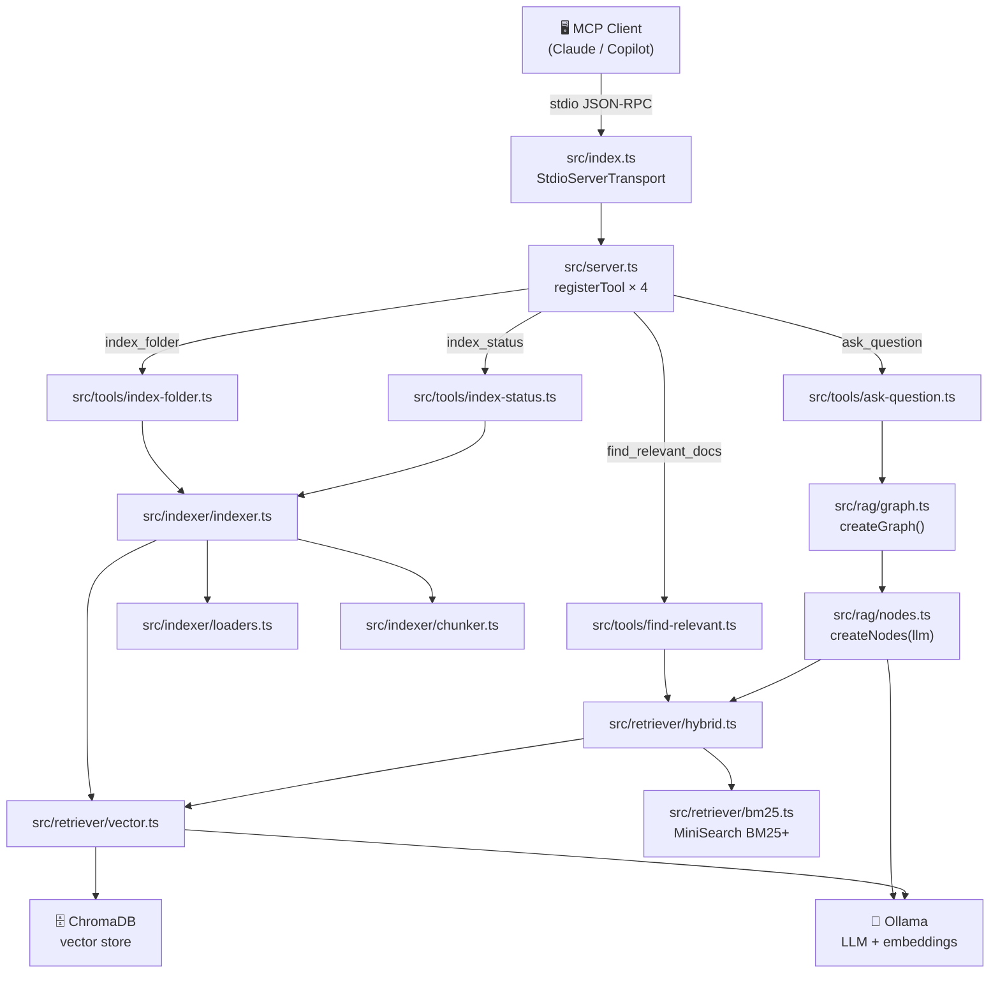
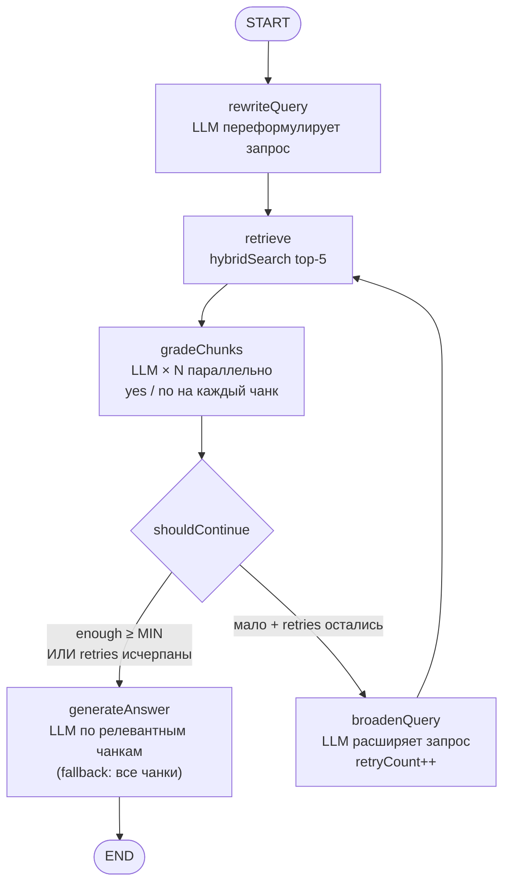
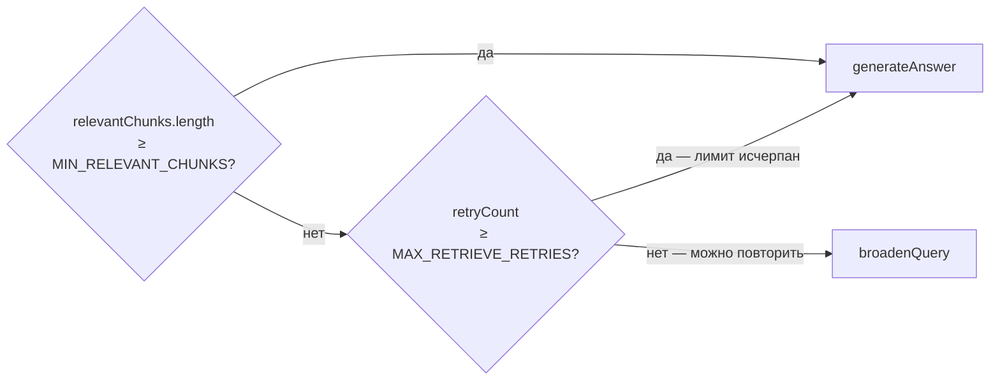
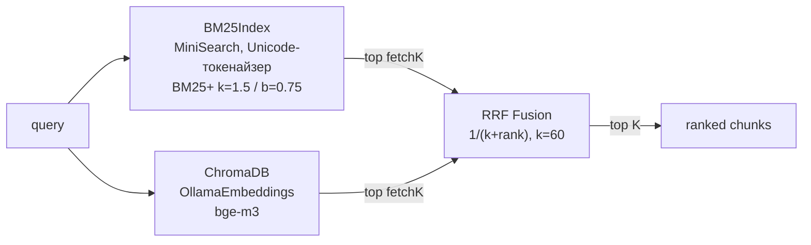
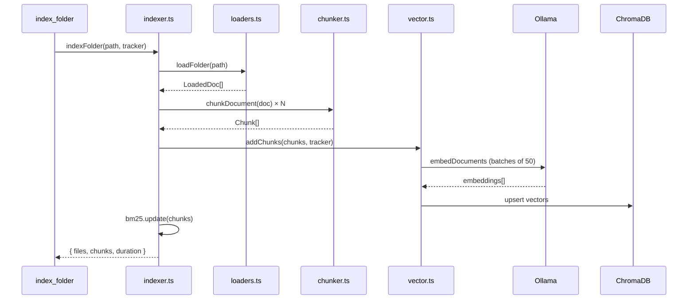
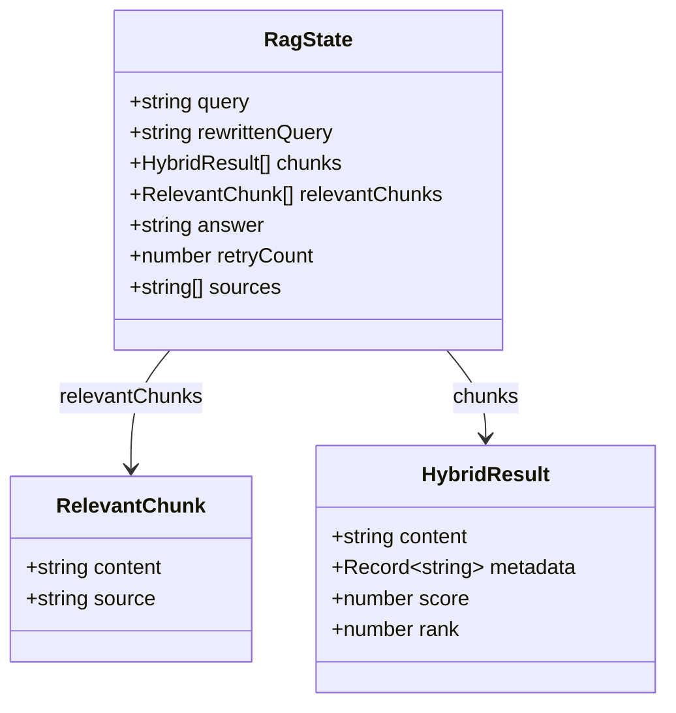

# Architecture

Node.js/TypeScript MCP server implementing a Corrective RAG pipeline. Exposes 4 tools to MCP clients (Claude, Copilot, etc.) via stdio transport.

## Request Flow

## Module Responsibilities

| Module | Role |
|--------|------|
| `src/index.ts` | Entry point, starts MCP server via StdioServerTransport |
| `src/server.ts` | Registers 4 MCP tools with Zod schemas and descriptions |
| `src/config.ts` | Parses all env vars via Zod; single `config` export |
| `src/tools/` | Thin handlers — call domain modules, format MCP response |
| `src/indexer/indexer.ts` | Coordinates load→chunk→embed→store; holds in-memory state |
| `src/indexer/loaders.ts` | Recursive folder scan, reads supported file extensions |
| `src/indexer/chunker.ts` | `RecursiveCharacterTextSplitter` with language-aware splitting |
| `src/indexer/summarizer.ts` | Generates one-sentence `domain_summary` from 15 random chunk samples via LLM |
| `src/retriever/vector.ts` | ChromaDB client + OllamaEmbeddings; singleton, batched at 50 |
| `src/retriever/bm25.ts` | `BM25Index` (MiniSearch, BM25+ k=1.5/b=0.75, Unicode tokenizer) |
| `src/retriever/hybrid.ts` | `hybridSearch()` — BM25 + vector in parallel, merged via RRF (k=60) |
| `src/rag/state.ts` | `Annotation.Root` — LangGraph state definition |
| `src/rag/nodes.ts` | `createNodes(llm, tracker?)` factory — 5 RAG nodes with progress notifications |
| `src/rag/graph.ts` | `StateGraph` assembly, `shouldContinue` router; `createGraph(llm?, tracker?)` per-call |
| `src/rag/prompts.ts` | Prompt templates — EN retrieval queries, responds in user's language |
| `src/progress/tracker.ts` | `ProgressTracker` — embedding batches + RAG step MCP progress notifications |

## Corrective RAG Graph

**Routing logic (`shouldContinue`):**

## Hybrid Search

`fetchK = topK × 2` — каждый ретривер возвращает больше кандидатов, RRF выбирает лучшие.

## Indexing Pipeline

## State Shape (LangGraph)

## External Services

| Service | Default URL | Purpose |
|---------|------------|---------|
| Ollama | `http://localhost:11434` | LLM inference + embeddings |
| ChromaDB | `http://localhost:8000` | Vector store (HTTP client only in Node.js) |

**На Mac: нативный Ollama обязателен.** Docker на Mac работает без Metal/Neural Engine — эмбеддинги ~16× медленнее (~384 vs ~6300 tok/s).

## Conventions

- **stdout — священен.** MCP использует stdio transport. Никаких `console.log` в продакшн-коде; только `console.error` для debug.
- **Node.js built-ins** с префиксом `node:` (`node:fs`, `node:path`).
- **Приватные хелперы** под `// HELPERS` с `_` префиксом.
- **Biome:** 2 пробела, одинарные кавычки, точка с запятой, trailing commas, lineWidth 100.
- **`ProgressTracker`** — новый инстанс на каждый tool call в `server.ts`.
- **`createGraph(llm?, tracker?)`** — создаётся per-call (нет синглтона); `tracker` инжектируется для MCP progress notifications.
