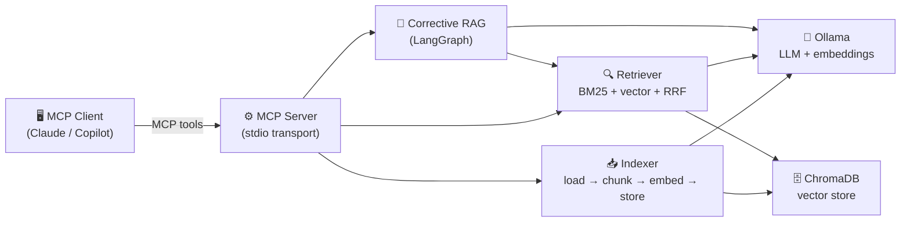
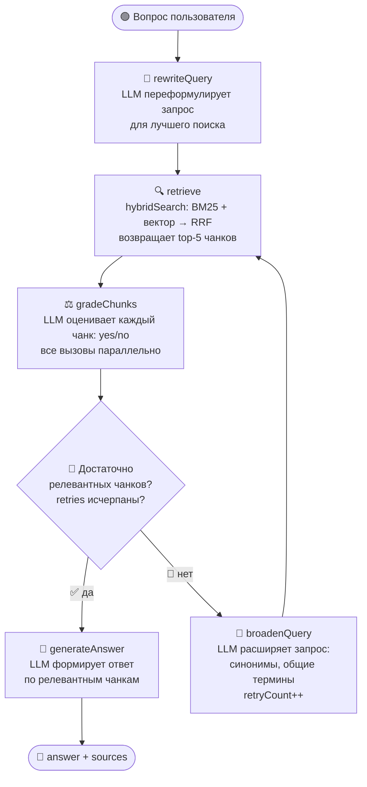

# corrective-rag-mcp

MCP-сервер, превращающий локальную папку с документами в поисковую базу знаний. Использует Corrective RAG pipeline (LangGraph) с локальной LLM через Ollama.

## Архитектура



## Требования

- Node.js 20+
- [Ollama](https://ollama.com) (нативный, не Docker — см. ниже)
- ChromaDB (через Docker или нативно)

## Быстрый старт

```bash
# 1. Установить зависимости
npm install

# 2. Создать .env
cp .env.example .env

# 3. Запустить ChromaDB
docker run -p 8000:8000 chromadb/chroma

# 4. Скачать модели Ollama
ollama pull qwen2.5:3b
ollama pull nomic-embed-text

# 5. Запустить сервер в MCP Inspector
npm run dev
```

> **Apple Silicon (M1/M2/M3):** используй нативный Ollama, не Docker. Ollama в Docker на Mac работает без Metal GPU — скорость эмбеддингов ~16× ниже (~384 vs ~6300 tok/s).

## Подключение к IDE

Собери проект (`npm run build`), затем добавь в настройки MCP-клиента:

```json
{
  "mcpServers": {
    "rag-knowledge-base": {
      "command": "node",
      "args": ["/path/to/corrective-rag-mcp/dist/index.js"],
      "env": {
        "OLLAMA_BASE_URL": "http://localhost:11434",
        "OLLAMA_MODEL": "qwen2.5:3b",
        "OLLAMA_EMBEDDING_MODEL": "nomic-embed-text",
        "CHROMA_URL": "http://localhost:8000",
        "CHROMA_COLLECTION": "rag_documents",
        "MIN_RELEVANT_CHUNKS": "2",
        "MAX_RETRIEVE_RETRIES": "2"
      }
    }
  }
}
```

## Инструменты MCP

| Инструмент | Что делает | Статус |
|-----------|-----------|--------|
| `index_folder(folder_path)` | Индексирует все файлы в папке (.md, .txt, .py, .js, .ts, .json, .yaml) | ✅ |
| `index_status()` | Возвращает статистику индекса: файлы, чанки, время последней индексации | ✅ |
| `find_relevant_docs(query, top_k)` | Гибридный поиск BM25 + вектор + RRF, без генерации ответа | ✅ |
| `ask_question(question)` | Полный Corrective RAG pipeline: rewrite → retrieve → grade → generate | ✅ |

### Формат ответов

**`ask_question`:**
```json
{
  "answer": "Dragons can use fire breath...",
  "sources": ["sample_docs/docs/abilities.md"],
  "chunks_used": 3,
  "retries": 0
}
```

**`find_relevant_docs`:**
```json
{
  "chunks": [
    { "content": "...", "source": "file.md", "score": 0.033, "rank": 1 }
  ],
  "total": 5
}
```

## Corrective RAG Pipeline



Если релевантных чанков меньше `MIN_RELEVANT_CHUNKS` — запрос расширяется и поиск повторяется (до `MAX_RETRIEVE_RETRIES` раз). После исчерпания попыток ответ генерируется из лучших доступных чанков.

## Демо-документы

В `sample_docs/` — документация фэнтезийной игры (~750 чанков, 26 файлов): механики, классы, предметы, лор, исходный код игровых систем. Включает документы на русском языке для проверки поиска по кириллице.

```bash
# Проверочная сессия через MCP Inspector
npm run dev
# → index_status()                              — пустой индекс
# → index_folder("./sample_docs")               — индексация (~20с на Apple M1)
# → index_status()                              — статистика (файлы, чанки)
# → ask_question("What is Kedraxis?")           — ответ с источниками
# → find_relevant_docs("dragon abilities", 5)   — список чанков без генерации
```

## Конфигурация

| Переменная | По умолчанию | Описание |
|-----------|-------------|---------|
| `OLLAMA_BASE_URL` | `http://localhost:11434` | URL Ollama |
| `OLLAMA_MODEL` | `qwen2.5:3b` | Модель для LLM-вызовов |
| `OLLAMA_EMBEDDING_MODEL` | `nomic-embed-text` | Модель для эмбеддингов |
| `CHROMA_URL` | `http://localhost:8000` | URL ChromaDB |
| `CHROMA_COLLECTION` | `rag_documents` | Название коллекции |
| `MIN_RELEVANT_CHUNKS` | `2` | Минимум релевантных чанков для генерации |
| `MAX_RETRIEVE_RETRIES` | `2` | Максимум попыток расширения запроса |

## Разработка

```bash
npm run test        # тесты (vitest watch)
npx vitest run      # тесты одним прогоном (49 тестов)
npm run check       # biome lint + format
npm run build       # компиляция TypeScript
npm run dev         # MCP Inspector
```
