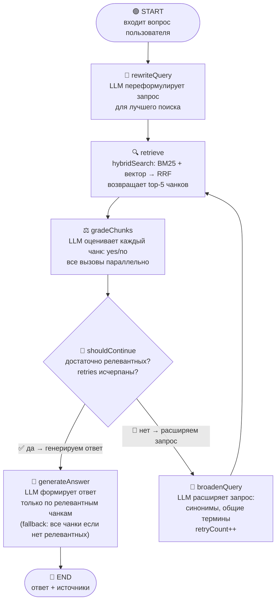
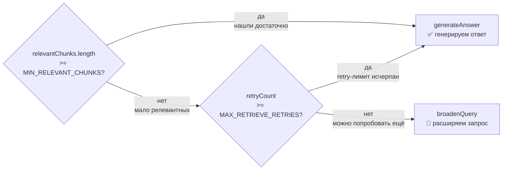
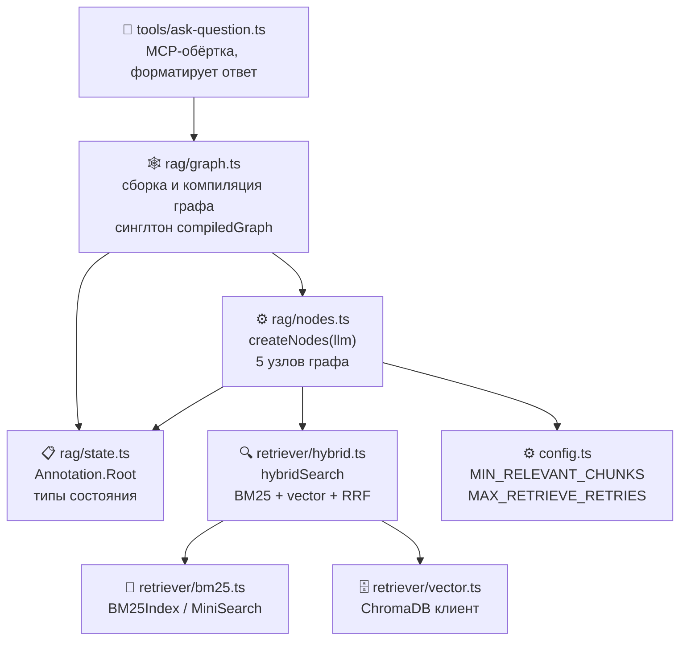
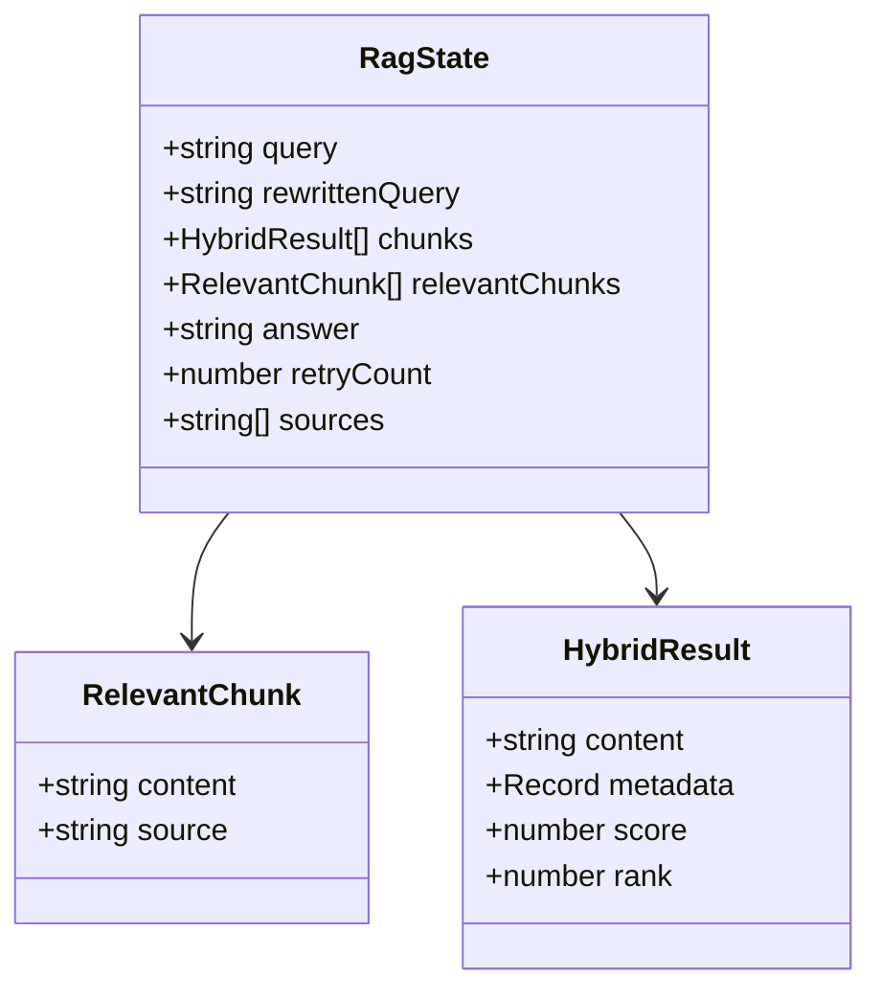
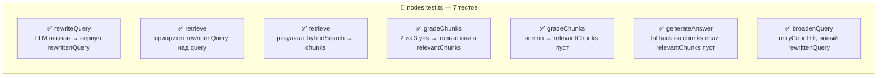
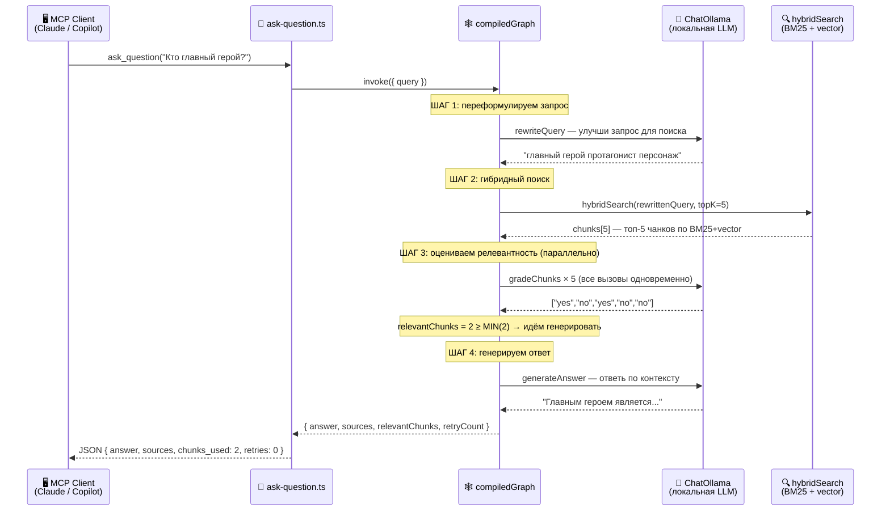

# Итерация 4: LangGraph Corrective RAG — Design Spec

**Дата:** 2026-06-25  
**Статус:** Approved

---

## Цель

Реализовать инструмент `ask_question`: полный Corrective RAG пайплайн на LangGraph.
Граф принимает вопрос, выполняет гибридный поиск, оценивает релевантность чанков,
при необходимости расширяет запрос и повторяет поиск (до 2 раз), затем генерирует ответ.

---

## Граф (поток управления)



Роутинг после `gradeChunks`:
- `relevantChunks.length >= MIN_RELEVANT_CHUNKS` → `generateAnswer`
- `retryCount >= MAX_RETRIEVE_RETRIES` → `generateAnswer` (fallback с тем что есть)
- иначе → `broadenQuery`

---

## Логика роутинга `shouldContinue`



---

## Зависимости модулей



---

## Файлы

| Файл | Действие | Описание |
|------|----------|----------|
| `src/rag/state.ts` | создать | `Annotation.Root` — состояние графа |
| `src/rag/nodes.ts` | создать | `createNodes(llm)` — 5 узлов |
| `src/rag/graph.ts` | создать | `createGraph(llm?)` + синглтон `compiledGraph` |
| `src/rag/__tests__/nodes.test.ts` | создать | unit-тесты узлов с fake LLM |
| `src/rag/__tests__/graph.test.ts` | создать | тесты роутинга `shouldContinue` |
| `src/tools/ask-question.ts` | обновить | вызов `compiledGraph.invoke()` |

**Новая зависимость (runtime):** `@langchain/langgraph` → `dependencies` в `package.json`.

---

## `state.ts` — состояние графа



```typescript
import { Annotation } from '@langchain/langgraph';
import type { HybridResult } from '../retriever/hybrid.js';

export interface RelevantChunk {
  content: string;
  source: string;
}

export const RagState = Annotation.Root({
  query: Annotation<string>(),
  rewrittenQuery: Annotation<string>({ default: () => '' }),
  chunks: Annotation<HybridResult[]>({ default: () => [] }),
  relevantChunks: Annotation<RelevantChunk[]>({ default: () => [] }),
  answer: Annotation<string>({ default: () => '' }),
  retryCount: Annotation<number>({ default: () => 0 }),
  sources: Annotation<string[]>({ default: () => [] }),
});
```

---

## `nodes.ts` — узлы графа

### API

```typescript
export function createNodes(llm: ChatOllama): {
  rewriteQuery: (state) => Promise<Partial<RagState>>;
  retrieve: (state) => Promise<Partial<RagState>>;
  gradeChunks: (state) => Promise<Partial<RagState>>;
  generateAnswer: (state) => Promise<Partial<RagState>>;
  broadenQuery: (state) => Promise<Partial<RagState>>;
}
```

### Поведение узлов

**`rewriteQuery`**
- Промпт (EN): перефразировать запрос для лучшего поиска в базе знаний
- Возвращает: `{ rewrittenQuery: string }`

**`retrieve`**
- Вызывает `hybridSearch(state.rewrittenQuery || state.query, 5)`
- `topK=5` — хардкод (оптимально для small LLM, не перегружает грейдинг)
- Возвращает: `{ chunks: HybridResult[] }`

**`gradeChunks`**
- Запрос для каждого чанка: релевантен ли он вопросу? (`"yes"` / `"no"`)
- Все вызовы параллельно через `Promise.all`
- Парсинг: `response.content.trim().toLowerCase().startsWith('yes')`
- Возвращает: `{ relevantChunks: RelevantChunk[] }`

**`generateAnswer`**
- Если `relevantChunks` пуст (retries исчерпаны) — fallback на все `chunks`
- Промпт: ответить на вопрос только по предоставленному контексту; если недостаточно — сказать об этом
- Дедуплицирует источники через `Set`
- Возвращает: `{ answer: string, sources: string[] }`

**`broadenQuery`**
- Промпт: расширить запрос, добавить синонимы / более общие термины
- Возвращает: `{ rewrittenQuery: string, retryCount: state.retryCount + 1 }`

### Зависимости узлов

- LLM (`ChatOllama`) — инжектируется через `createNodes(llm)`
- `hybridSearch` — мокается в тестах через `vi.mock('../../retriever/hybrid.js')`
- `config.rag` — мокается в тестах через `vi.mock('../../config.js')`

---

## `graph.ts` — сборка графа

```typescript
export function createGraph(llm?: ChatOllama): CompiledStateGraph {
  const model = llm ?? new ChatOllama({ ... });
  const nodes = createNodes(model);

  return new StateGraph(RagState)
    .addNode('rewriteQuery', nodes.rewriteQuery)
    .addNode('retrieve', nodes.retrieve)
    .addNode('gradeChunks', nodes.gradeChunks)
    .addNode('generateAnswer', nodes.generateAnswer)
    .addNode('broadenQuery', nodes.broadenQuery)
    .addEdge(START, 'rewriteQuery')
    .addEdge('rewriteQuery', 'retrieve')
    .addEdge('retrieve', 'gradeChunks')
    .addConditionalEdges('gradeChunks', shouldContinue, ['generateAnswer', 'broadenQuery'])
    .addEdge('broadenQuery', 'retrieve')
    .addEdge('generateAnswer', END)
    .compile();
}

export const compiledGraph = createGraph();
```

**Роутинговая функция** (экспортируется для тестов):
```typescript
export function shouldContinue(state: RagStateType): 'generateAnswer' | 'broadenQuery' {
  const enough = state.relevantChunks.length >= config.rag.minRelevantChunks;
  const exhausted = state.retryCount >= config.rag.maxRetrieveRetries;
  return (enough || exhausted) ? 'generateAnswer' : 'broadenQuery';
}
```

---

## `ask-question.ts` — обновление

```typescript
import { compiledGraph } from '../rag/graph.js';

export async function handleAskQuestion(question: string) {
  const result = await compiledGraph.invoke({ query: question });
  return {
    content: [{
      type: 'text' as const,
      text: JSON.stringify({
        answer: result.answer,
        sources: result.sources,
        chunks_used: result.relevantChunks.length,
        retries: result.retryCount,
      }),
    }],
  };
}
```

---

## Тесты

### `nodes.test.ts` (~7 тестов)



Setup:
```typescript
vi.mock('../../retriever/hybrid.js', () => ({ hybridSearch: vi.fn() }));
vi.mock('../../config.js', () => ({ config: { rag: { minRelevantChunks: 2, maxRetrieveRetries: 2 } } }));
const fakeLlm = { invoke: vi.fn() };
const nodes = createNodes(fakeLlm as unknown as ChatOllama);
```

### `graph.test.ts` (~4 теста)

Тест-кейсы для `shouldContinue`:
1. `relevantChunks.length >= minRelevantChunks` → `'generateAnswer'`
2. `retryCount >= maxRetrieveRetries` → `'generateAnswer'` (даже если мало чанков)
3. мало чанков + retries остались → `'broadenQuery'`
4. 0 чанков + 0 retries → `'broadenQuery'`

**Итого новых тестов: ~11** (существующих: 37, станет ~48).

---

## Последовательность вызовов: полный запрос



---

## Обработка ошибок

- Ошибка LLM в любом узле — пробрасывается наверх, `handleAskQuestion` оборачивает в MCP error response
- `hybridSearch` бросает (ChromaDB/Ollama недоступны) — аналогично
- Пустой индекс → `hybridSearch` вернёт `[]` → `gradeChunks` вернёт `[]` → после MAX_RETRIES `generateAnswer` скажет "не хватает информации"

---

## Конвенции (из CLAUDE.md)

- Файлы в `src/rag/` — Node.js built-ins с `node:` префиксом (если нужны)
- Приватные хелперы под `// HELPERS` с `_` префиксом (`shouldContinue` экспортируется — не хелпер)
- Никаких `console.log` в production коде, только `console.error` для debug
- Biome: 2 пробела, одинарные кавычки, точка с запятой, trailing commas, lineWidth 100
